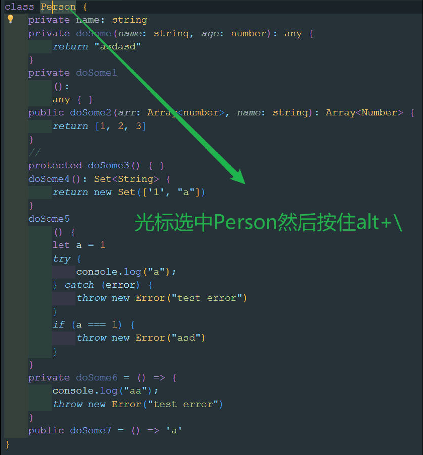

# 开发日志
## 10月25日

知识储备

  - 学习vscode插件开发文档
  - 学习Git提交代码以及分支管理
## 10月26日
1. 开发环境准备：
   - 安装了GIt，使用GIt进行版本控制和代码提交
   - 搭建了GitHub仓库
   - 安装Generator-code：Generator-code是一个生成器，专门用于创建和管理VS Code扩展。
2. 搭建项目结构
   - 使用npm install -g yo generator-code创建了项目
   - 建立开发分支dev1.0.0
   - 提交项目到了GitHub
3. 遇到问题
   - Git使用不够熟练，特别是在远程分支同步以及分支合并上
4. 解决方案
   - 查询Git使用教程

## 10月27日

1. **任务目标**：项目架构
- 实现通过快捷键激活命令
  
- 添加注释类与用户注释配置相映射
  
- 添加注释装饰器类，目标功能为实现向类和方法添加注释


   - 添加拾取器获取光标所在上下文
   - 添加解析器，解析拾取器获取的文档生成注释

2. 实现

   - 拾取器：拾取器主要的任务在于拾取上下文对象用于后续注释生成，拾取完成后返回包含拾取信息的上下文对象
     1. 拾取的是方法，则需要拾取完整的方法，包括方法权限、方法名、方法返回值、方法抛出异常
     2. 拾取的是类，则仅仅需要拾取到类名结束
     3. 两者都不是则不进行拾取
     4. 拾取完成后还要判断拾取的内容上方情况，为了后续的注释插入

   - 解析器：解析器的任务在与根据拾取器放回的上下文对象建立实际的注释映射
     1. 利用正则表达式提取类名、方法权限、方法名、方法返回值、方法抛出异常等要在注释中展示的内容
     2. 加载配置，实现用户定制内容，包括日期格式、名字映射等
        最终生成注释对象
   - 注释对象：注释对象是实际注释的抽象，包含注释的位置，内容等信息，并有注释生成方法最终实现注释的生成

3. 问题所在：

   - 应该减轻拾取器的负担，它有太多的职责
   - 正则表达式有局限性，因为方法类型太多无法完成匹配

4. 问题分析
   - 使用AST语法树代替正则表达式

## 10月28日

1. **任务目标**
   - 拾取器拾取实现到文件信息，单词信息，行号
   - 通过AST识别出方法、类、属性等信息
2. **实现途径**
   - 调用vscodeAPI来完成信息的拾取需要的信息
   - 通过Typescript来编译器API来讲ts文件解析为AST语法树然后遍历节点获取节点信息
3. **遇到问题**
   - Typescript编译器API太过于复杂，学习成本很高
   - 保存后的文件信息行号发生变动，导致注释冲突
4. **解决方案**
   - 寻找typescript的编译器封装库来完成，减轻开发负担，这里找到的是ts-morph

5. **完成情况**：已经能够实现了完成根据名字识别出具体信息然后生成基本的jsDoc风格的注释了

## 10月29日
已经基本实现了添加注释功能，但是还有一些bug，以及项目架构的问题需要解决
bug包括
1. 撤销保存时注释会出现问题
2. 若有注释应该删除原来的注释

待开发
1.应该读取配置来决定生成的内容，且允许用户进行配置

## 10月30日
对于bug的解决方案
1. 不能添加后自动保存，这是违反直觉的，最好不以次为解决方案
2. 尝试不使用原生的typescript编译器 而使用ts-morph来进行解决，方法注释应该由此工具类来添加
3. 经过验证ts-morph是一个可行的解决方案，使用map来记录生成的注释（测试看是否会因为位置的变动而不能删除），同时对于用户自己添加的注释要与现有注释进行对比看是否要添加

## 11月2日

1. **任务目标**：完成基本的注释生成

2. **遇到问题**

   - 生成注释格式需要进行调整，如@Return后不应该有换行等

   - 对于vscode缩进为2的编辑器格式会出现问题，但是缩进为4的编辑器格式不会出现问题

3. **解决方案**
   - 去除@Return后的换行，以及调整格式

4. **未解决的问题**
   - 缩进为2的编辑器注释格式混乱

## 11月3日

1. **任务目标**
   - 引入翻译接口，实现对文本的翻译
   - 引入配置文件，实现注解的可定制化

2. **遇到问题**

   - 翻译接口需要进行充值，如谷歌翻译、百度翻译等免费使用次数为10000个字符数

   - 不明确用户可以进行哪些配置

3. **解决方案**

   - 四个接口平均访问，这样免费的字符数可以达到40000个，40000个字符使用完成后可以允许用户自己配置翻译接口的秘钥

   - 用户可以进行如下的配置

   ```tsx
   export interface GlobalAnnotationConfig {
       // 是否加上作者,填写作者名
       author?: string | null,
       // 是否加上邮箱
       email?: string | null,
       // 是否加上电话
       tel?: string | null,
       // 是否加上描述
       description?: string | null
       // 是否加上时间
       date?: boolean,
       // 是否加上日期时间
       dateTime?: boolean,
   }
   export interface ClassAnnotationConfig extends GlobalAnnotationConfig {
       className?: (className: string) => string
   }
   export interface MethodAnnotationConfig extends GlobalAnnotationConfig {
       // 参数 可以不开启也可以用户自己指定
       parameters?: boolean | ((parameters: Map<string, string>) => string)
       // 返回值
       returnType?: boolean,
       // 抛出异常
       throwErrors?: boolean | ((throwErrors: Array<string>) => string)
       // 相同异常类型是否合并
       throwMerge?: boolean
   }
   export interface PropertyAnnotationConfig extends GlobalAnnotationConfig {
       // 类型是否开启
       propertyType?: boolean
   }
   // 单词映射
   export interface WordMaps {
       [key: string]: string
   }
   export interface AnnotationConfig {
       // 全局配置
       globalConfig?: GlobalAnnotationConfig
       // 类配置
       classConfig?: ClassAnnotationConfig,
       // 方法注解配置
       methodConfig?: MethodAnnotationConfig,
       // 属性配置
       propertyConfig?: PropertyAnnotationConfig
       // 单词映射
       wordMaps?: WordMaps
   }
   ```

## 11月5日

1. **任务目标**

   - 明确支持的配置文件格式有哪些，以及加载的优先级

   - 创建配置管理器类实现对配置的加载，基本实现配置读取

2. **遇到问题**
   - 目前只能支持json格式的配置和vscode内部的配置而对于js类型和ts类型的配置文件则不能实现，因为插件和npm下载的依赖还是有很大的差别的，npm下载的依赖很容易提供类型文件以实现配置提示
   - json配置文件的局限性还是很大的，其灵活性不如js和ts的配置文件，并且json文件不能像ts那样轻松的实现类型提示
   - 但是ts配置文件要通过语言服务器难度很大

3. **解决方案**

   - 配置优先级：本地ts配置>本地js配置>本地配置json配置>vscode配置

   - js和ts方案失败，后续再考虑

4. **完成情况**
   - 能够加载json配置文件和vscode配置文件，并对配置文件进行合并


## 11月6日

1. **任务目标**
   - 实现文本切割和单词映射
   - 实现基于配置生成注解

2. **遇到问题**

   - 文本切割需要根据驼峰命名法来进行切割

   - 生成AST和进行网络翻译（异步）会导致性能过差，生成注释会有明显的时延
   - 解决格式的一些小问题
   - 解决通过行号获取成员信息时由于行号不同带来的获取不到成员的问题

3. **解决方案**

   - 考虑采用预解析以及观察者模式来提前解析文件为AST语法树

   - 考虑开启子进程来进行多进程的解析

